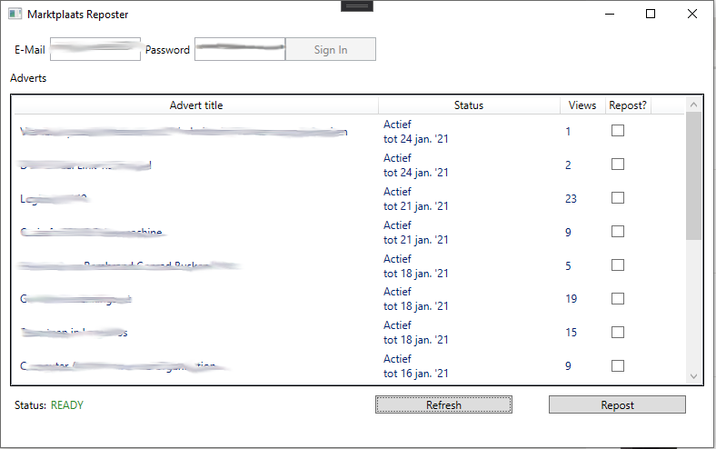

# Marktplaats Reposter
Warning: Use at your own risk, marktplaats may change their web application causing this application to fail. Note that only the master branch will be guaranteed to be up to date.

Allows user to choose and repost ads on Marktplaats in order to move them to the top. At the moment only ads with a price are supported.

## Requirements
* Windows 10 64bit
* Requires [Chromedriver](https://chromedriver.chromium.org/) to be installed in `C:/Chromedriver/chromedriver.exe` corresponding to the [Chrome](https://www.google.com/chrome/) version installed on the system.

## Build from source
Open the project in [Microsoft Visual Studio](https://visualstudio.microsoft.com/downloads/). Then run 'Build solution (F6)'.

## Installation instructions
Either build the project or download the release zip.
Extract the release zip file in a directory of choosing. Next you can run the program by double clicking the 'marktplaatsreposter.exe' file.

## How to use
Enter your marktplaats email and password then click on sign in. Wait for the program to finish signing in and the 'Refresh' button to become enabled.
Download the list of your adverts by clicking on the 'Refresh' button, this should take a few minutes. Next select the adverts you want to
repost and hit the 'Repost' button. This process should take ~2 minutes per advert.
